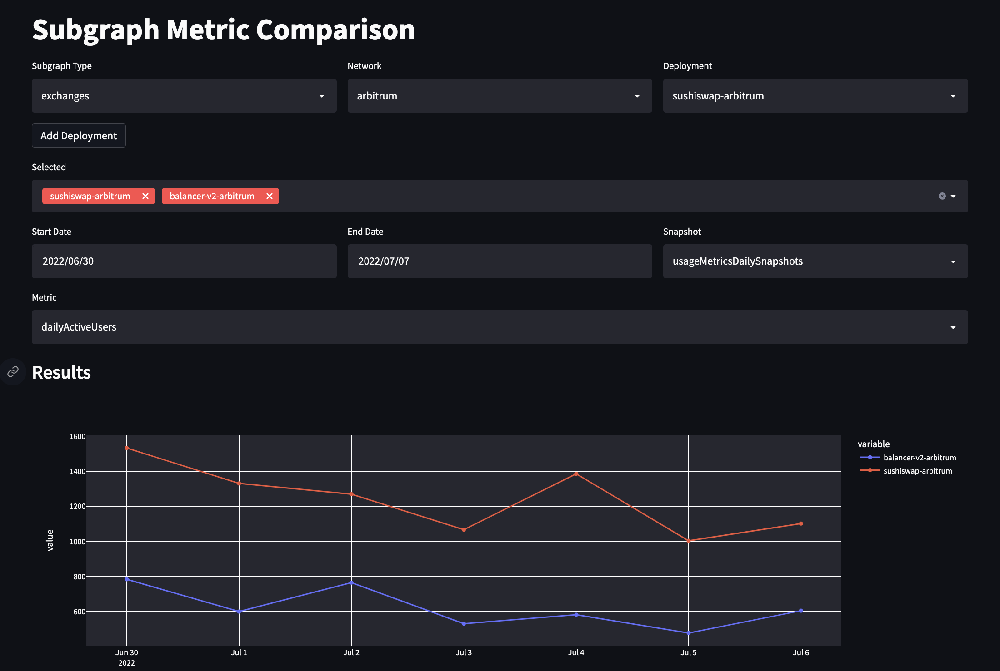

# Subgraph QA Data App

## Installation

To use the data app, please be sure to have Python 3.10 or higher installed, and a working Python env manager like `pyenv`, `virtualenv`, `venv` or `conda`. We'll use `virtalenv` for this example:

First create a virtual environment
```
~$ virtualenv data-app-env --python=python3.10
```

Next, activate the environment
```
~$ source /path/to/data-app-env/bin/activate
```

Once in your virtual environment, navigate to the `data-validation-app` directory and run the following
```
pip3 install -r requirements.txt
```

After all of the dependencies have been installed in your environment, you can run the app via
```
streamlit run app.py
```

## Current Features

### Comparison Panel



The Subgraph Comparison app allows you to select subgraphs by subgraph type and network and compare the plots of the associated metrics side by side in both plots, tables and statistical reporting. The current feature set is a follows:

- Filtering and selection of multiple subgraph sources
	- via subgraph_type/network

- Filtering and selection via date range and metric type

- Dynamic line chart display supporting multiple metrics

- pandas_profiling expander section showing statistical summaries and correlation analysis around metrics

*Known Issues*

- Metric section dropdown is a bit buggy and will require you to select the `Snapshot` dropdown at atleast twice before the `Metric` dropdown populates

- The "pool level" metric types are being populated in, but need some extra data processing to display (currently `liquidityPoolDailySnapshots`, `marketDailySnapshots`, and `vaultDailySnapshots are broken`)

### Distribution Panel